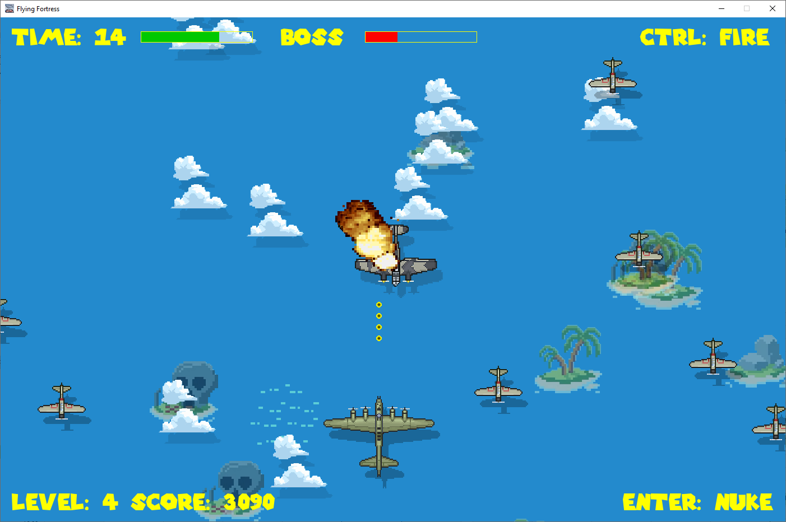

# "Flying Fortress"
Another tiny vertical scroller game made with Python and pygame. 

Inspired by a demo for a public session on programming simple games conducted at The Lycaeum in Sep/2014.

Extra game logic and artwork by fabrice.kauffmann@gmail.com



## Keys

| Key | Role |
| --- | ---- |
| Arrows | Move your plane |
| CTRL | Fire guns |
| ENTER | Nuke all enemies (only once per level) |


## History

* 2024.08.12 - initial version
* 2024.08.14 - difficulty level handling
* 2024.08.15 - energy bar added
* 2024.08.16 - parallax scrolling added

## Requirements

* pygame==2.6.0

## Setup (Linux)

Navigate to project folder 
```
python3 -m venv .venv
cd .venv
cd bin
source activate
cd ../..
pip install pygame
python3 game.py
```

## Setup (Windows)

Navigate to project folder 
```
python -m venv .venv
cd .venv
cd scripts
activate
cd ..\..
pip install pygame
python game.py
```

